<style>
    /* initialise the counter */
    body { counter-reset: figureCounter; }
    /* increment the counter for every instance of a figure even if it doesn't have a caption */
    figure { counter-increment: figureCounter; }
    /* prepend the counter to the figcaption content */
    figure figcaption:before {
        content: "Figure " counter(figureCounter) ": "
    }
</style>


# Training Results
This document shows the training results of both perpendicular parking and parallel parking.

## Perpendicular Parking

### Default Setting (Reward/State: type1)

- Parameter settings for the training

```
config = Config(car_length=4.0, car_width=2.0,
                wheel_length=0.75, wheel_width=0.35,
                parking_length=6.0, parking_width=4.0,
                max_distance=25.0, max_steps=80,
                acceleration_limit=1.0, steering_limit=PI/4, velocity_limit=2.77778,
                max_angle_error=PI/12, center_threshold=0.5, penalty_ratio={'angle': 0.25, 'velocity': 0.25},
                reward_type='type1', state_type='type1',
                side=(1, 2, 3, 4), car_loc_randomize_range=(-2.5, 2.5), initial_distance_range=(5.0, 7.5)
                )
                
env_config = {"render_mode": "no_render",
              "action_type": "continuous",  # or "discrete"
              "parking_type": "perpendicular",
              "training_mode": "on",
              'config': config}

num_train = 100
```

- Trained agent (Continuous action)


- Training results (Continuous action)

<figure>
    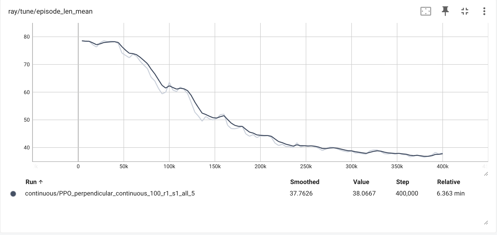
    <figcaption>The mean episode length of the continuous action space in the type1 of the perpendicular parking for the 100-iteration training</figcaption>
</figure>

<figure>
    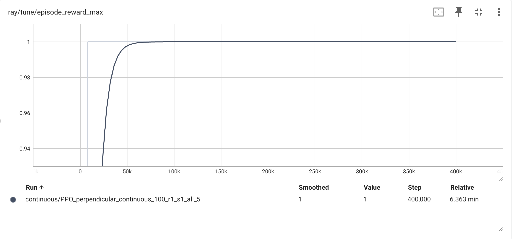
    <figcaption>The maximum reward in each iteration of the continuous action space in the type1 of the perpendicular parking for the 100-iteration training</figcaption>
</figure>

<figure>
    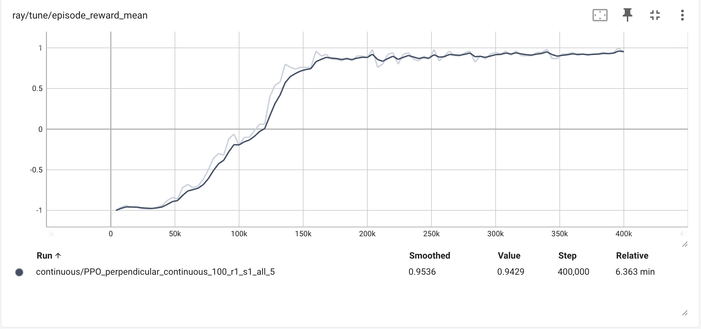
    <figcaption>The mean reward in each episode of the continuous action space in the type1 of the perpendicular parking for the 100-iteration training</figcaption>
</figure>

- Result analysis  


### Guidance Reward (Reward/State: type2)

- Parameter settings for the training

```
config = Config(car_length=4.0, car_width=2.0,
                wheel_length=0.75, wheel_width=0.35,
                parking_length=6.0, parking_width=4.0,
                max_distance=25.0, max_steps=100,
                acceleration_limit=1.0, steering_limit=PI/4, velocity_limit=2.77778,
                max_angle_error=PI/4.5, center_threshold=0.5, penalty_ratio={'angle': 0.5, 'velocity': 0.0},
                reward_type='type2', state_type='type2',
                side=1, car_loc_randomize_range=(-2.5, 2.5), initial_distance_range=(5.5, 7.5)
                )
                
env_config = {"render_mode": "no_render",
              "action_type": "continuous",  # or "discrete"
              "parking_type": "perpendicular",
              "training_mode": "on",
              'config': config}

num_train = 100
```


<figure>
    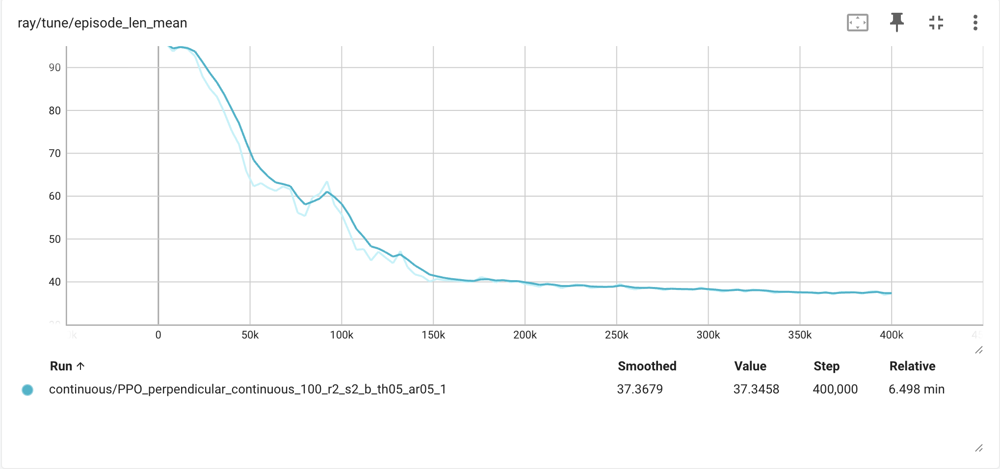
    <figcaption>The mean episode length of the continuous action space in the type2 of the perpendicular parking for the 100-iteration training</figcaption>
</figure>

<figure>
    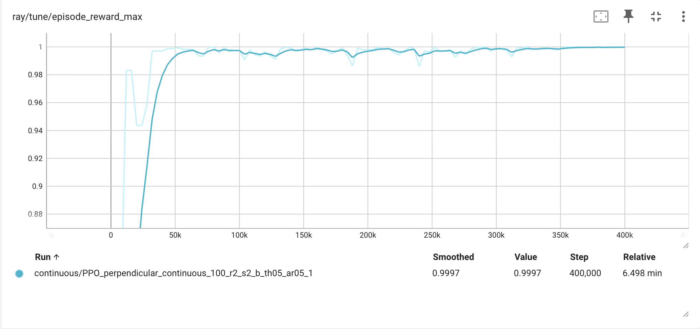
    <figcaption>The maximum reward in each iteration of the continuous action space in the type2 of the perpendicular parking for the 100-iteration training</figcaption>
</figure>

<figure>
    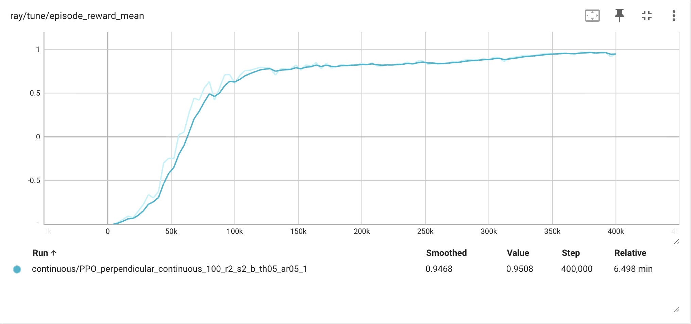
    <figcaption>The mean reward in each episode of the continuous action space in the type2 of the perpendicular parking for the 100-iteration training</figcaption>
</figure>

- Result analysis


### Velocity Penalty (Reward/State: type3)
- Parameter settings for the training

```
config = Config(car_length=4.0, car_width=2.0,
                wheel_length=0.75, wheel_width=0.35,
                parking_length=6.0, parking_width=4.0,
                max_distance=25.0, max_steps=80,
                acceleration_limit=1.0, steering_limit=PI/4, velocity_limit=2.77778,
                max_angle_error=PI/12, center_threshold=0.5, penalty_ratio={'angle': 0.0, 'velocity': 0.5},
                reward_type='type3', state_type='type3',
                side=1, car_loc_randomize_range=(-2.5, 2.5), initial_distance_range=(5.5, 7.5)
                )
                
env_config = {"render_mode": "no_render",
              "action_type": "continuous",  # or "discrete"
              "parking_type": "perpendicular",
              "training_mode": "on",
              'config': config}

num_train = 200
```

- Trained agent (Continuous action)


- Training results (Continuous action)

<figure>
    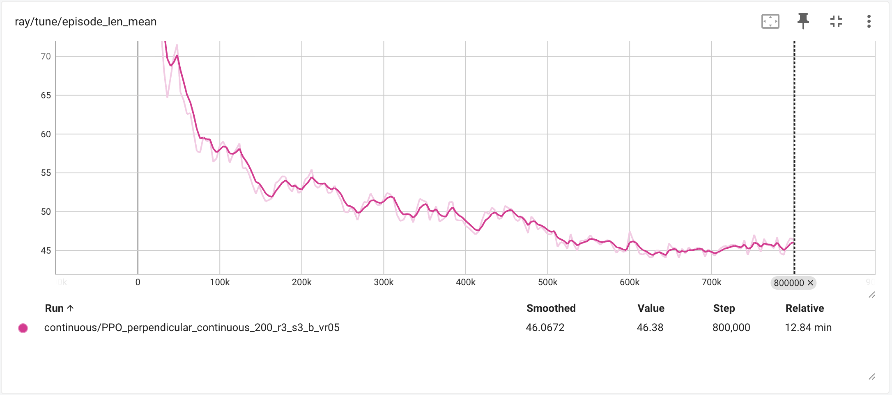
    <figcaption>The mean episode length of the continuous action space in the type3 of the perpendicular parking for the 100-iteration training</figcaption>
</figure>

<figure>
    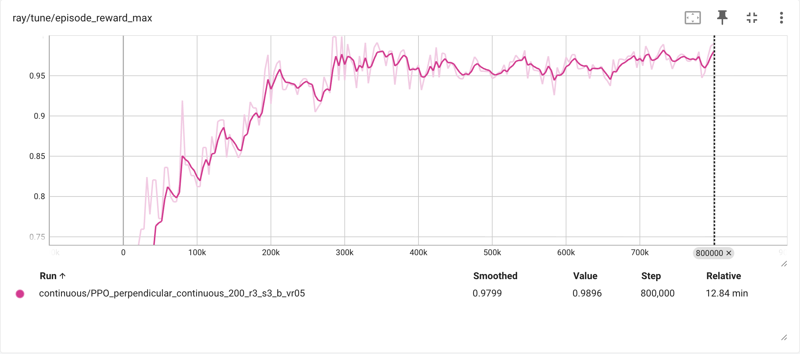
    <figcaption>The maximum reward in each iteration of the continuous action space in the type3 of the perpendicular parking for the 100-iteration training</figcaption>
</figure>

<figure>
    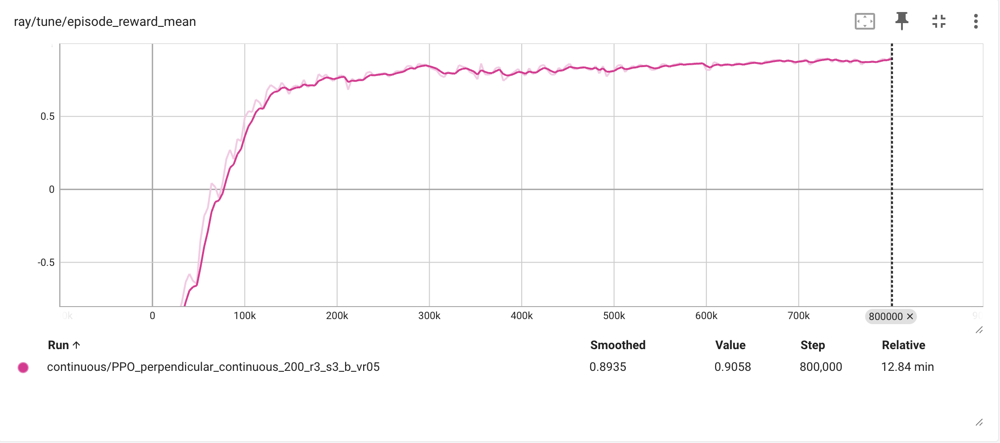
    <figcaption>The mean reward in each episode of the continuous action space in the type3 of the perpendicular parking for the 100-iteration training</figcaption>
</figure>

- Training analysis  


### Both Guidance Reward and Velocity Penalty (Reward/State: type4)
- Parameter settings for the training

```
config = Config(car_length=4.0, car_width=2.0,
                wheel_length=0.75, wheel_width=0.35,
                parking_length=6.0, parking_width=4.0,
                max_distance=25.0, max_steps=80,
                acceleration_limit=1.0, steering_limit=PI/4, velocity_limit=2.77778,
                max_angle_error=PI/4.5, center_threshold=0.5, penalty_ratio={'angle': 0.25, 'velocity': 0.25},
                reward_type='type4', state_type='type4',
                side=1, car_loc_randomize_range=(-2.5, 2.5), initial_distance_range=(5.5, 7.5)
                )
                
env_config = {"render_mode": "no_render",
              "action_type": "continuous",  # or "discrete"
              "parking_type": "perpendicular",
              "training_mode": "on",
              'config': config}

num_train = 200
```

- Trained agent (Continuous action)


- Training results (Continuous action)

<figure>
    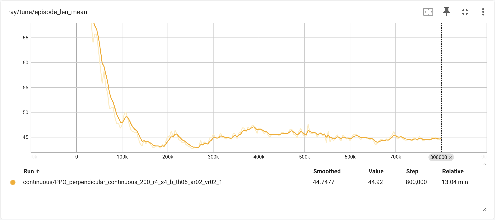
    <figcaption>The mean episode length of the continuous action space in the type4 of the perpendicular parking for the 100-iteration training</figcaption>
</figure>

<figure>
    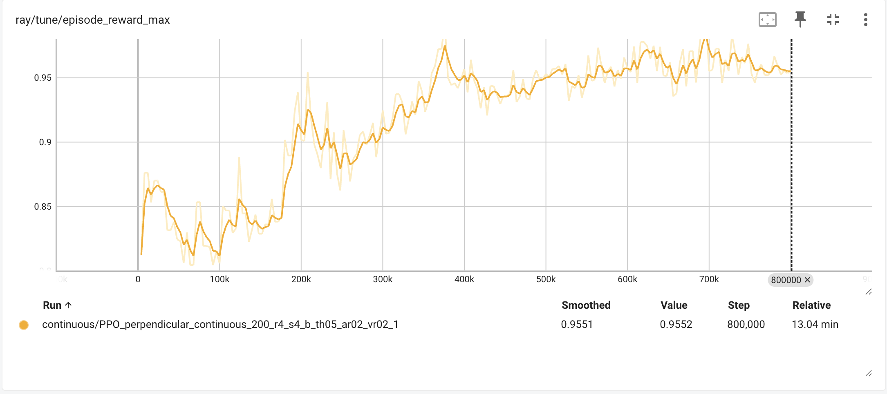
    <figcaption>The maximum reward in each iteration of the continuous action space in the type4 of the perpendicular parking for the 100-iteration training</figcaption>
</figure>

<figure>
    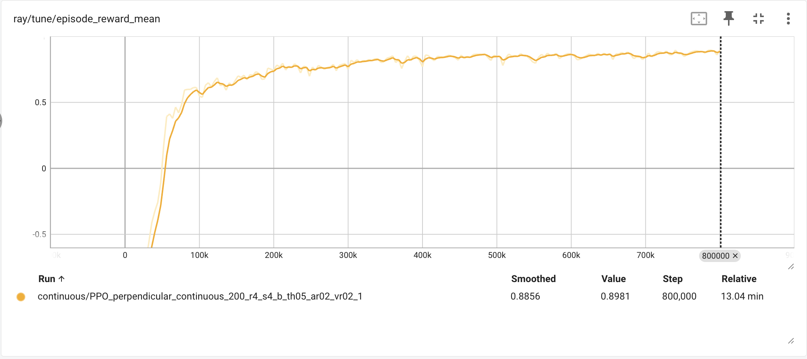
    <figcaption>The mean reward in each episode of the continuous action space in the type4 of the perpendicular parking for the 100-iteration training</figcaption>
</figure>

- Training analysis  


## Parallel Parking
### Default Setting (Reward/State: type1)

- Parameter settings for the training

```
config = Config(car_length=4.0, car_width=2.0,
                wheel_length=0.75, wheel_width=0.35,
                parking_length=6.0, parking_width=4.0,
                max_distance=25.0, max_steps=80,
                acceleration_limit=1.0, steering_limit=PI/4, velocity_limit=2.77778,
                max_angle_error=PI/12, center_threshold=0.5, penalty_ratio={'angle': 0, 'velocity': 0.5},
                reward_type='type1', state_type='type1',
                side=1, car_loc_randomize_range=(5.5, 6.0), initial_distance_range=(5.0, 6.0),
                heading_angle_range={"parallel": {1: (PI/6, PI/4)}}
                )
                
env_config = {"render_mode": "no_render",
              "action_type": "continuous",
              "parking_type": "parallel",
              "training_mode": "on",
              'config': config}

num_train = 100

```

- Trained agent (Continuous action)


- Training results (Continuous action)

<figure>
    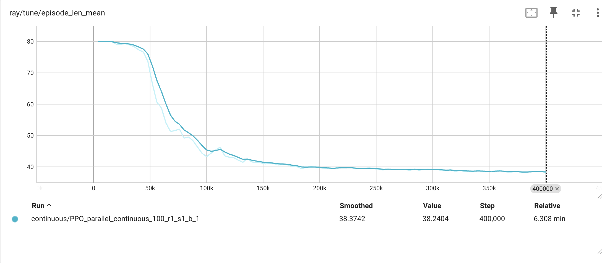
    <figcaption>The mean episode length of the continuous action space in the type1 of the parallel parking for the 100-iteration training</figcaption>
</figure>

<figure>
    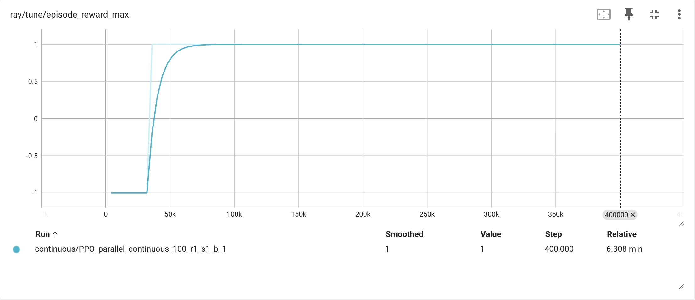
    <figcaption>The maximum reward in each iteration of the continuous action space in the type1 of the parallel parking for the 100-iteration training</figcaption>
</figure>

<figure>
    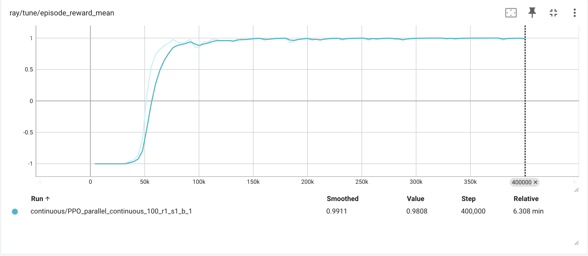
    <figcaption>The mean reward in each episode of the continuous action space in the type1 of the parallel parking for the 100-iteration training</figcaption>
</figure>

- Training analysis  


### Guidance Reward (Reward/State: type2)

- Parameter settings for the training

```
config = Config(car_length=4.0, car_width=2.0,
                wheel_length=0.75, wheel_width=0.35,
                parking_length=6.0, parking_width=4.0,
                max_distance=25.0, max_steps=80,
                acceleration_limit=1.0, steering_limit=PI/4, velocity_limit=2.77778,
                max_angle_error=PI/6, center_threshold=0.5, penalty_ratio={'angle': 0.5, 'velocity': 0.0},
                reward_type='type2', state_type='type2',
                side=1, car_loc_randomize_range=(5.5, 6.0), initial_distance_range=(4.0, 5.0),
                heading_angle_range={"parallel": {1: (PI/6, PI/4)}}
                )

env_config = {"render_mode": "no_render",
              "action_type": "continuous",
              "parking_type": "parallel",
              "training_mode": "on",
              'config': config}

num_train = 100

```

- Trained agent (Continuous action)


- Training results (Continuous action)

<figure>
    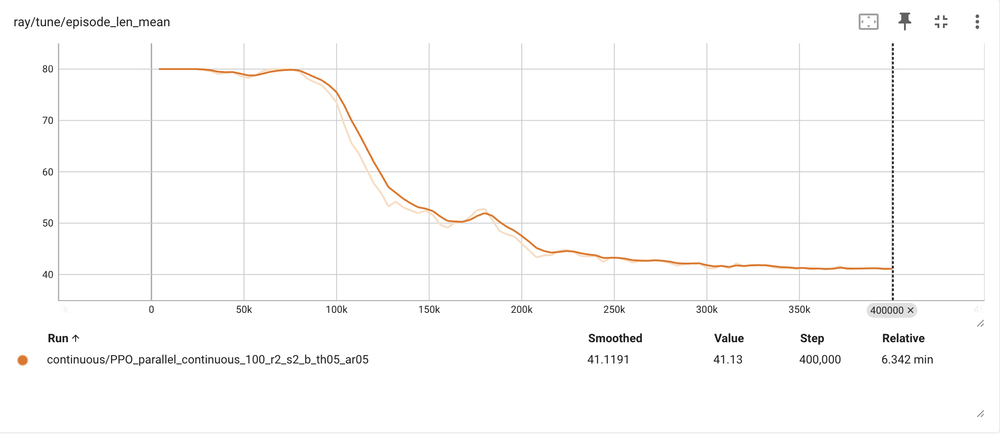
    <figcaption>The mean episode length of the continuous action space in the type2 of the parallel parking for the 100-iteration training</figcaption>
</figure>

<figure>
    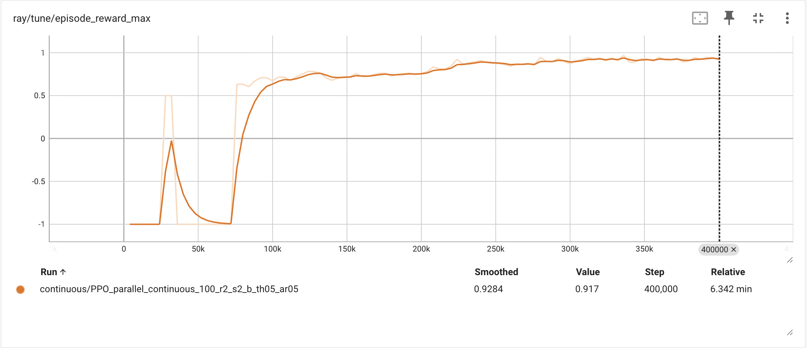
    <figcaption>The maximum reward in each iteration of the continuous action space in the type2 of the parallel parking for the 100-iteration training</figcaption>
</figure>

<figure>
    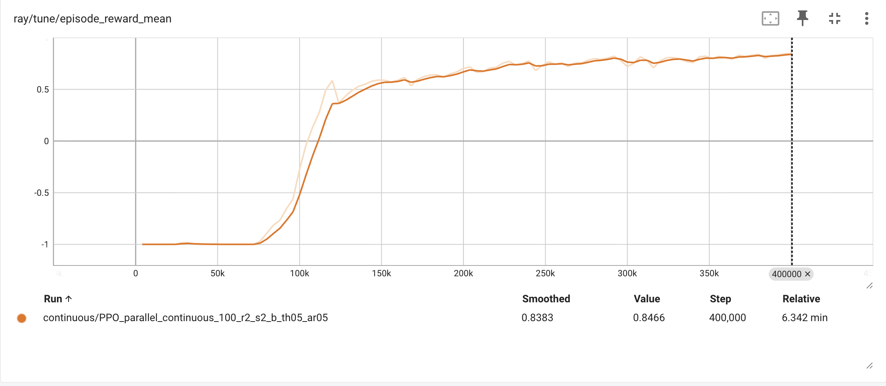
    <figcaption>The mean reward in each episode of the continuous action space in the type2 of the parallel parking for the 100-iteration training</figcaption>
</figure>

- Training analysis  


### Velocity Penalty (Reward/State: type3)
- Parameter settings for the training

```
config = Config(car_length=4.0, car_width=2.0,
                wheel_length=0.75, wheel_width=0.35,
                parking_length=6.0, parking_width=4.0,
                max_distance=25.0, max_steps=80,
                acceleration_limit=1.0, steering_limit=PI/4, velocity_limit=2.77778,
                max_angle_error=PI/12, center_threshold=1.0, penalty_ratio={'angle': 0.0, 'velocity': 0.5},
                reward_type='type3', state_type='type3',
                side=1, car_loc_randomize_range=(5.5, 6.0), initial_distance_range=(4.0, 5.0),
                heading_angle_range={"parallel": {1: (PI/6, PI/4)}}
                )

env_config = {"render_mode": "no_render",
              "action_type": "continuous",
              "parking_type": "parallel",
              "training_mode": "on",
              'config': config}

num_train = 100

```

- Trained agent (Continuous action)  


- Training results (Continuous action)

<figure>
    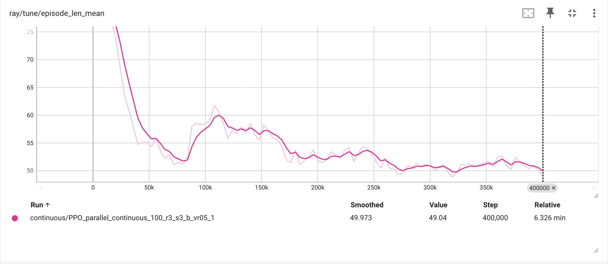
    <figcaption>The mean episode length of the continuous action space in the type1 of the parallel parking for the 100-iteration training</figcaption>
</figure>

<figure>
    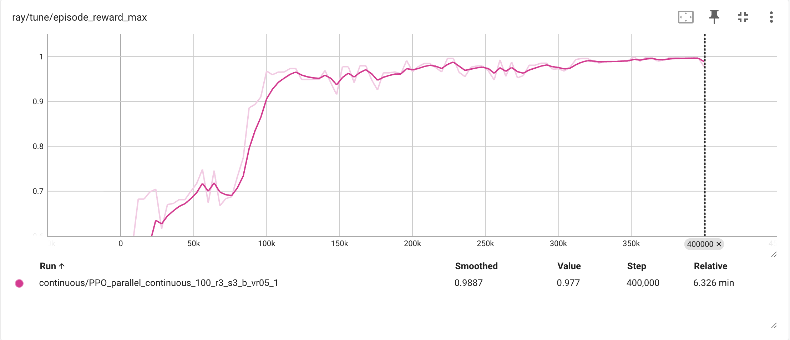
    <figcaption>The maximum reward in each iteration of the continuous action space in the type3 of the parallel parking for the 100-iteration training</figcaption>
</figure>

<figure>
    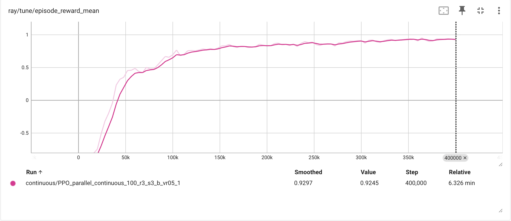
    <figcaption>The mean reward in each episode of the continuous action space in the type3 of the parallel parking for the 100-iteration training</figcaption>
</figure>

- Training analysis  


### Both Guidance Reward and Velocity Penalty (Reward/State: type4)
- Parameter settings for the training

```
config = Config(car_length=4.0, car_width=2.0,
                wheel_length=0.75, wheel_width=0.35,
                parking_length=6.0, parking_width=4.0,
                max_distance=25.0, max_steps=80,
                acceleration_limit=1.0, steering_limit=PI/4, velocity_limit=2.77778,
                max_angle_error=PI/6, center_threshold=0.5, penalty_ratio={'angle': 0.25, 'velocity': 0.25},
                reward_type='type4', state_type='type4',
                side=1, car_loc_randomize_range=(5.5, 6.0), initial_distance_range=(4.0, 5.0),
                heading_angle_range={"parallel": {1: (PI/6, PI/4)}}
                )

env_config = {"render_mode": "no_render",
              "action_type": "continuous",
              "parking_type": "parallel",
              "training_mode": "on",
              'config': config}

num_train = 100

```

- Trained agent (Continuous action)


**This is a test code for video** 

<video width="720" height="360" controls>
  <source src="../training/assets/parallel_parking/parallel_type4.mov" type="video/mp4">
  Your browser does not support the video tag.
</video>

- Training results (Continuous action)

<figure>
    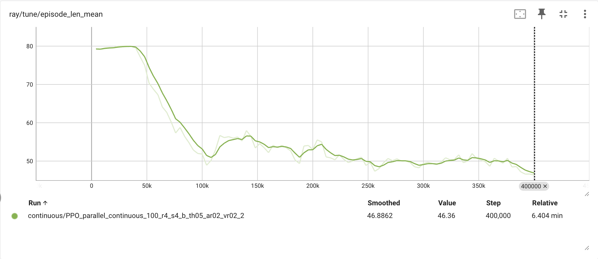
    <figcaption>The mean episode length of the continuous action space in the type4 of the parallel parking for the 100-iteration training</figcaption>
</figure>

<figure>
    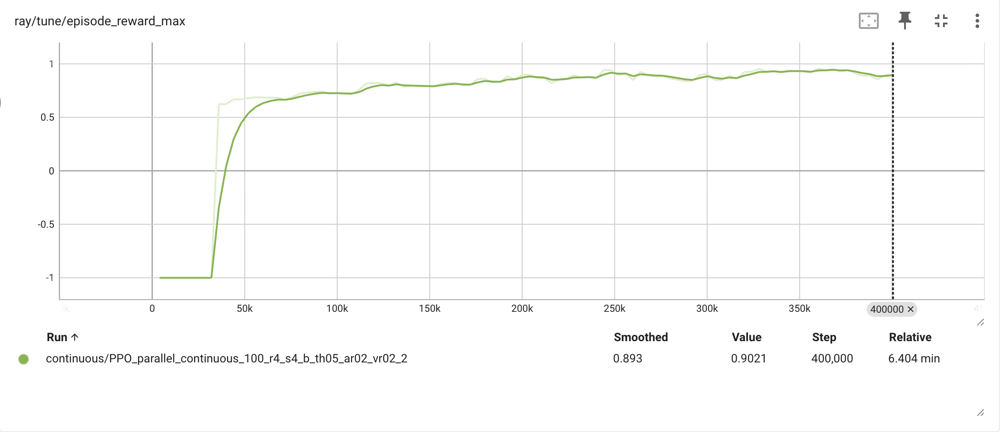
    <figcaption>The maximum reward in each iteration of the continuous action space in the type4 of the parallel parking for the 100-iteration training</figcaption>
</figure>

<figure>
    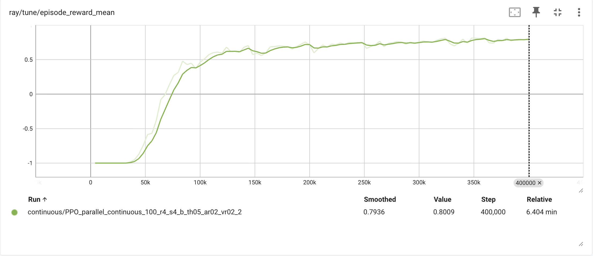
    <figcaption>The mean reward in each episode of the continuous action space in the type4 of the parallel parking for the 100-iteration training</figcaption>
</figure>

- Training analysis  


## Conclusion


### Future developments

